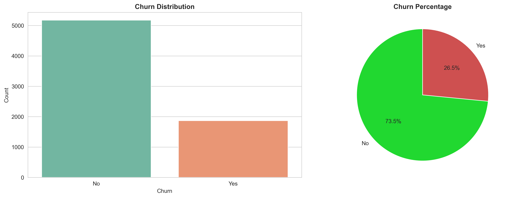
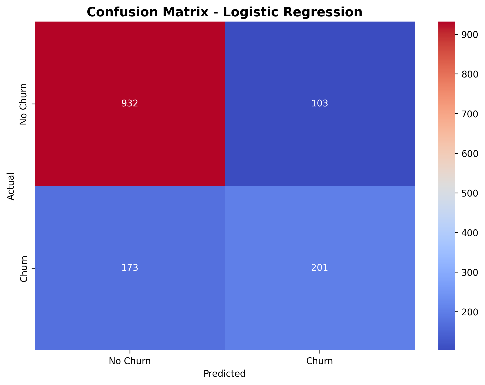

# Customer Churn Prediction

## Overview

This project predicts customer churn using machine learning based on customer behavior, services used, and billing patterns.The objective is to identify high-risk customers early so that retention strategies can be applied.

---

## Problem

Customer churn directly impacts revenue.
The task is to classify whether a customer will churn (Yes/No) using historical customer data.

---

## Data

The dataset contains customer-level information:

* Demographics
* Account details
* Services subscribed
* Billing and charges

Target variable:

* Churn

The dataset is moderately imbalanced, which influences model evaluation.

---

## Approach

### Data Preparation

* Handled missing values
* Converted data types
* Encoded categorical variables
* Scaled numerical features

### Feature Engineering

* Created tenure-based groups
* Derived number of services used
* Built spending-related features

### Model Training

Trained and compared multiple models:

* Logistic Regression
* Decision Tree
* Random Forest
* Gradient Boosting

### Evaluation

Used:

* ROC-AUC (primary metric)
* Precision
* Recall
* F1-score

---

## Results

The model is able to distinguish churn and non-churn customers with stable performance.
Evaluation metrics indicate good separation between classes without overfitting.

---

## Key Insights

* Customers with short tenure have higher churn risk
* Contract type strongly influences churn
* Higher monthly charges are associated with churn
* Customers without support services are more likely to leave

---

## Visual Insights

### Churn Distribution



### Feature Importance


### ROC Curve


### Confusion Matrix



---

## Project Structure

* data → dataset
* notebooks → analysis and experiments
* pipeline → preprocessing and feature logic
* models → trained models
* reports → evaluation outputs

---

## How to Run

1. Install dependencies:

```
pip install -r requirements.txt
```

2. Run notebooks:

* EDA
* preprocessing
* model training


## Author

Divyanshu Tiwari
